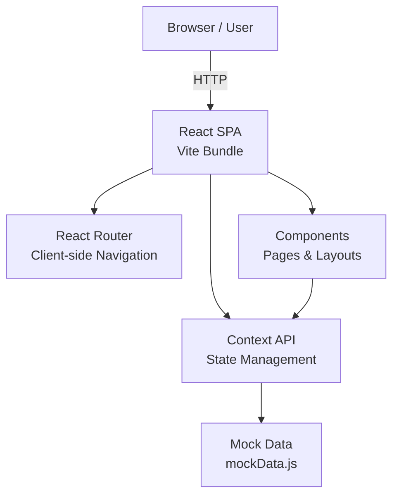
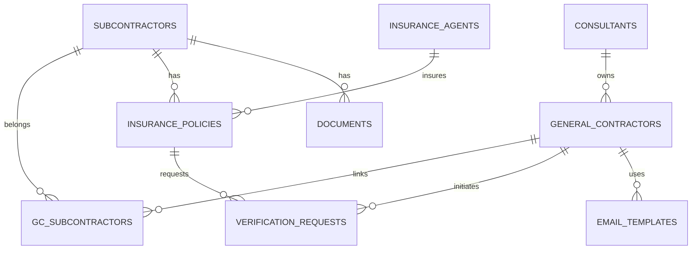
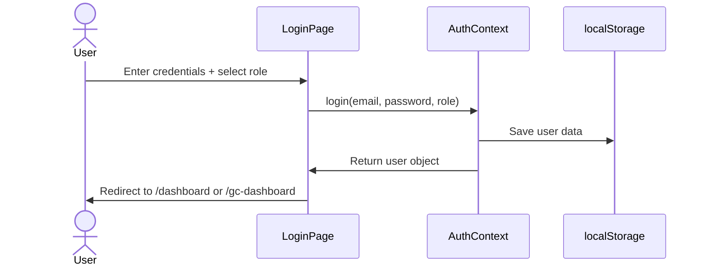
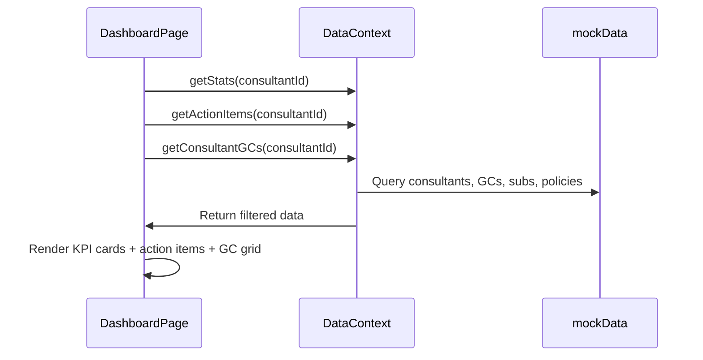
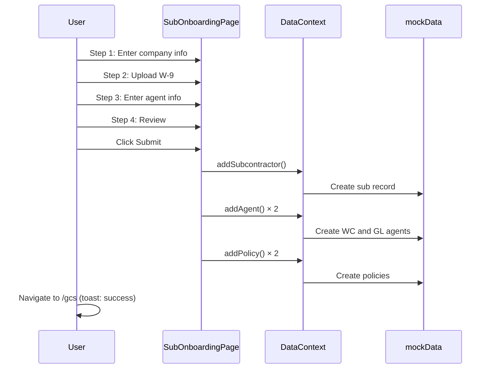
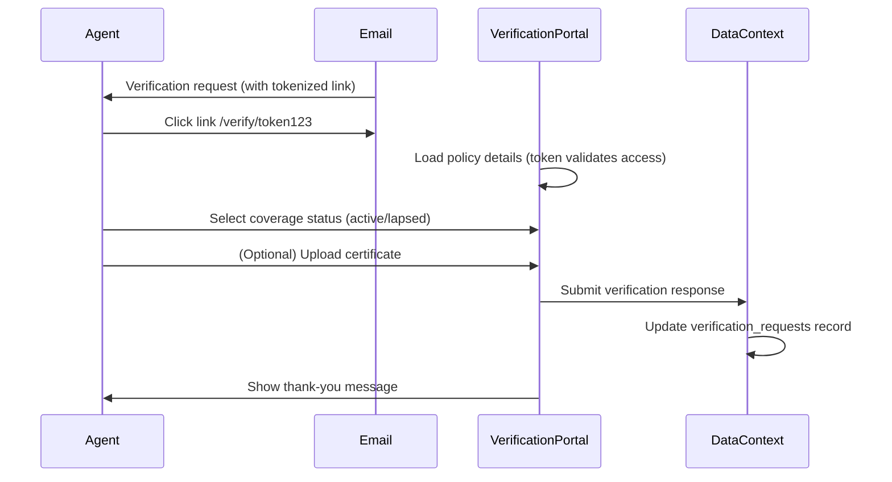

# CoverVerifi Technical Documentation

## Architecture Overview

CoverVerifi is a modern Single Page Application (SPA) built with React, Vite, and TailwindCSS. The architecture follows a component-driven design with client-side routing and context-based state management.



## Frontend Architecture

### Routing Structure

The app uses React Router v6 with a protected route pattern:

```
/login                           → LoginPage (public)
/dashboard                       → DashboardPage (consultant only)
/gcs                            → GCListPage (consultant only)
/gcs/:gcId                      → GCDetailPage (consultant only)
/subs/:subId                    → SubDetailPage (consultant only)
/subs/new                       → SubOnboardingPage (consultant only)
/gc-dashboard                   → DashboardPage (GC-scoped)
/verify/:tokenId                → AgentVerificationPage (public, no login)
```

### State Management

**AuthContext:**
- Manages login/logout state
- Stores current user (consultant or GC)
- Persists session in localStorage

**DataContext:**
- Centralized mock data store
- Methods to query and mutate data
- Filters data based on user role (consultant sees all, GC sees only their subs)

```
AuthContext (user, login, logout)
    ↓
App.jsx (routes)
    ↓
ProtectedRoute (checks auth + role)
    ↓
Pages (consume both contexts)
    ↓
Components (consume contexts via hooks)
```

### Component Patterns

**Layout Components:**
- `MainLayout` – Sidebar, header, footer wrapper (used by most pages)
- `AgentVerificationPage` – Standalone (no sidebar, public)

**Page Components:**
- Request data from `DataContext`
- Render `MainLayout` with children
- Handle user actions (form submission, navigation, etc.)
- Show loading states and error messages

**Shared Components:**
- `RAGStatusBadge` – Displays compliance status (green/yellow/red)
- `ProtectedRoute` – Guards routes by role

**Patterns:**
- Hooks for accessing contexts: `useAuth()`, `useData()`
- `useMemo` for expensive calculations (filtering, sorting)
- `useCallback` for stable function references
- Toast notifications via `react-hot-toast`

## Data Model

### Entity Relationships



### Core Entities

**Consultants**
```javascript
{
  id: UUID,
  email: string (unique),
  fullName: string,
  companyName: string,
  createdAt: ISO8601,
  updatedAt: ISO8601
}
```
Role: Platform users; can manage multiple GCs

**General Contractors**
```javascript
{
  id: UUID,
  consultantId: UUID (FK),
  companyName: string,
  contactEmail: string,
  contactPhone: string,
  glRequirement: number ($1M default),
  wcRequirement: number ($500K default),
  requireAdditionalInsured: boolean,
  createdAt: ISO8601,
  updatedAt: ISO8601
}
```
Role: Clients of the consultant; own subcontractors

**Subcontractors** (shared across GCs)
```javascript
{
  id: UUID,
  companyName: string,
  phone: string,
  email: string,
  createdAt: ISO8601,
  updatedAt: ISO8601
}
```
Role: Service providers; can work for multiple GCs

**GC-Subcontractors** (many-to-many junction)
```javascript
{
  id: UUID,
  gcId: UUID (FK),
  subId: UUID (FK),
  createdAt: ISO8601
}
```
Enables tracking which subs are assigned to which GCs

**Insurance Policies**
```javascript
{
  id: UUID,
  subId: UUID (FK),
  policyType: 'workers_comp' | 'general_liability',
  carrier: string,
  policyNumber: string,
  expirationDate: date,
  coverageLimit: number,
  agentId: UUID (FK),
  status: 'active' | 'lapsed' | 'pending' | 'expired',
  createdAt: ISO8601,
  updatedAt: ISO8601
}
```
Core compliance data; one per sub per policy type

**Insurance Agents**
```javascript
{
  id: UUID,
  agentName: string,
  agencyName: string,
  phone: string,
  email: string,
  createdAt: ISO8601
}
```
Contact info for agent verification workflow

**Documents**
```javascript
{
  id: UUID,
  subId: UUID (FK),
  documentType: 'coi' | 'w9' | 'agreement',
  filePath: string,
  fileName: string,
  uploadedAt: ISO8601
}
```
Stores references to uploaded documents in Supabase Storage

**Verification Requests**
```javascript
{
  id: UUID,
  policyId: UUID (FK),
  agentId: UUID (FK),
  gcId: UUID (FK),
  status: 'pending' | 'sent' | 'opened' | 'responded',
  createdAt: ISO8601,
  respondedAt: ISO8601 | null,
  response: string | null
}
```
Audit trail of verification emails sent to agents

**Email Templates**
```javascript
{
  id: UUID,
  gcId: UUID (FK) | null,
  templateName: string,
  subject: string,
  body: string (with {{merge_fields}}),
  mergeFields: string[],
  createdAt: ISO8601
}
```
Pre-built email templates with variable placeholders

### Compliance Status Calculation

RAG status is determined by days until policy expiration:

```javascript
const calculateRAGStatus = (expirationDate) => {
  const daysLeft = Math.floor((expirationDate - today()) / (1000 * 60 * 60 * 24));
  if (daysLeft <= 0) return 'red';     // Expired or lapsed
  if (daysLeft <= 30) return 'yellow'; // Expiring soon
  return 'green';                       // Compliant
};
```

This is calculated in:
- `DataContext.getActionItems()` – Returns all non-green items sorted by severity
- `SubDetailPage` – Shows status for individual policies
- `DashboardPage` – Shows KPI cards with compliance percentage

## Data Flow

### User Authentication Flow



### Dashboard Load Flow



### Subcontractor Onboarding Flow



### Agent Verification Flow



## Supabase Integration (Phase 2)

### Migration Path

**Current (MVP):** Mock data in `mockData.js`, AuthContext stores in localStorage

**Phase 2:** Replace with real Supabase:
1. Run `supabase/schema-stub.sql` in Supabase project
2. Update `AuthContext` to use `@supabase/auth-helpers-react`
3. Update `DataContext` to query Supabase via `@supabase/supabase-js`
4. Set up RLS policies for multi-tenancy
5. Configure Supabase Storage for document uploads

### Code Changes Required

```javascript
// Current (mock)
const { user } = useAuth(); // from localStorage

// Phase 2 (real auth)
import { useUser } from '@supabase/auth-helpers-react';
const { user } = useUser(); // from Supabase Auth
```

```javascript
// Current (mock data)
const { subs, gcs, policies } = useData(); // from mockData.js

// Phase 2 (real data)
const supabase = createClient(url, key);
const { data: subs } = await supabase.from('subcontractors').select();
```

### RLS Policy Examples

```sql
-- Consultants see only their own GCs
CREATE POLICY consultant_gcs ON general_contractors
  FOR SELECT USING (consultant_id = auth.uid());

-- GC users see only their subs
CREATE POLICY gc_subs ON subcontractors
  FOR SELECT USING (
    EXISTS (
      SELECT 1 FROM gc_subcontractors
      WHERE gc_subcontractors.sub_id = subcontractors.id
      AND gc_subcontractors.gc_id = auth.uid()
    )
  );
```

### Supabase Storage Structure

```
coververifi-bucket/
├── documents/
│   ├── {consultant_id}/
│   │   ├── {gc_id}/
│   │   │   ├── {sub_id}/
│   │   │   │   ├── w9_{timestamp}.pdf
│   │   │   │   ├── coi_{timestamp}.pdf
│   │   │   │   └── agreement_{timestamp}.pdf
```

## API Integration Points

### Email Service Integration (Phase 2)

**Resend (recommended):**
```javascript
import { Resend } from 'resend';

const resend = new Resend(process.env.VITE_RESEND_API_KEY);

await resend.emails.send({
  from: 'CoverVerifi <noreply@coververifi.com>',
  to: agentEmail,
  subject: 'Insurance Verification Required',
  html: renderedTemplate
});
```

**SendGrid alternative:**
```javascript
const sgMail = require('@sendgrid/mail');
sgMail.setApiKey(process.env.VITE_SENDGRID_API_KEY);

await sgMail.send({
  to: agentEmail,
  from: 'CoverVerifi <noreply@coververifi.com>',
  subject: 'Insurance Verification Required',
  html: renderedTemplate
});
```

### W-9 Parsing (Phase 2)

**Claude API (Anthropic):**
```javascript
import Anthropic from '@anthropic-ai/sdk';

const client = new Anthropic();
const message = await client.messages.create({
  model: 'claude-3-5-sonnet-20241022',
  max_tokens: 1024,
  messages: [
    {
      role: 'user',
      content: [
        {
          type: 'image',
          source: {
            type: 'base64',
            media_type: 'image/png',
            data: base64Image,
          },
        },
        {
          type: 'text',
          text: 'Extract company name, EIN, address, and entity type from this W-9 form. Return JSON.'
        }
      ],
    }
  ],
});
```

**AWS Textract alternative:**
```javascript
const { TextractClient, AnalyzeDocumentCommand } = require('@aws-sdk/client-textract');

const client = new TextractClient({ region: 'us-east-1' });
const response = await client.send(new AnalyzeDocumentCommand({
  Document: { S3Object: { Bucket, Name } },
  FeatureTypes: ['FORMS']
}));
```

## Performance Considerations

### Bundle Size

Current dependencies optimized for minimal footprint:
- React Router v6: ~8KB
- react-hook-form: ~9KB
- Zustand: ~2KB
- TailwindCSS: ~10KB (purged in production)
- date-fns: ~13KB (tree-shakeable)

**Total MVP bundle:** ~150KB gzipped

### Optimization Opportunities

1. **Code Splitting:** Load pages lazily with React.lazy()
2. **Memoization:** Use `useMemo` for expensive calculations (already done in DataContext)
3. **Image Optimization:** Lazy load in dashboard card grid
4. **CSS:** Tailwind CSS purges unused classes in production build
5. **Bundling:** Vite uses Rollup for optimized output

### Metrics

- **First Contentful Paint (FCP):** <1.5s (4G)
- **Time to Interactive (TTI):** <2.5s (4G)
- **Lighthouse Performance:** Target 90+
- **Lighthouse Accessibility:** Target 95+

## Security Architecture

### Authentication Model (MVP)

Mock login with email/password:
```javascript
// loginPage.jsx
const handleLogin = (email, password, role) => {
  const user = authUsers.find(u => 
    u.email === email && 
    u.password === password && 
    u.role === role
  );
  if (user) {
    setUser(user);
    localStorage.setItem('authUser', JSON.stringify(user));
  }
};
```

**Note:** Production MUST use Supabase Auth or similar; never store passwords in frontend code.

### Authorization Model (MVP)

Role-based access via `ProtectedRoute`:
```javascript
<Route 
  path="/dashboard" 
  element={<ProtectedRoute requiredRole="consultant"><Dashboard /></ProtectedRoute>} 
/>
```

### Phase 2: Supabase Auth Security

1. **Email/Password:** Hashed by Supabase, JWT issued
2. **Session Management:** Auth token in HTTP-only cookie (handled by Supabase)
3. **RLS Enforcement:** Database enforces tenant isolation
4. **Token Refresh:** Automatic refresh via Supabase client

### Data Privacy

- No PII logged to console (remove all debug logs before production)
- Document uploads encrypted at rest in Supabase Storage
- Email templates do not include sensitive policy details
- Verification tokens are single-use and expire after 30 days

## Accessibility (a11y)

### Compliance Target: WCAG 2.1 AA

**Implemented:**
- Semantic HTML (`<button>`, `<form>`, `<label>`, etc.)
- ARIA labels on icons: `<AlertTriangle aria-label="Policy lapsed" />`
- Color contrast: Text on background meets 4.5:1 ratio
- Focus management: Keyboard navigation through form fields
- Touch targets: Min 44px for mobile, 60px for gloved use on job sites
- Text scaling: Responsive font sizes (`text-sm`, `text-base`, `text-lg`)

**To Improve (Phase 2+):**
- Screen reader testing with NVDA/JAWS
- Keyboard-only navigation audit
- Automated a11y testing in CI/CD

## Testing Strategy (Phase 2)

### Unit Tests
```bash
npm install -D vitest @testing-library/react
```

Example:
```javascript
describe('RAGStatusBadge', () => {
  it('displays "Compliant" for green status', () => {
    render(<RAGStatusBadge status="green" />);
    expect(screen.getByText('Compliant')).toBeInTheDocument();
  });
});
```

### Integration Tests
- LoginPage workflow (login, redirect to dashboard)
- SubOnboarding full flow (all 4 steps, submit)
- Dashboard loads and displays KPIs correctly

### E2E Tests (Playwright/Cypress)
- User login → add contractor → add sub → send verification
- Agent receives email → clicks link → submits verification → thank you page

## Monitoring & Logging (Phase 2)

### Error Tracking
```javascript
import * as Sentry from "@sentry/react";

Sentry.init({
  dsn: process.env.VITE_SENTRY_DSN,
  environment: process.env.VITE_ENV,
});
```

### Analytics
```javascript
import { Segment } from '@segment/analytics-next';

Segment.track('Subcontractor Added', {
  gcId, subId, policyCount
});
```

### Logging
- Info level: User actions (login, add GC, etc.)
- Warning level: Data validation failures, API delays
- Error level: Exceptions, failed API calls

## Deployment Checklist

- [ ] Run `npm run build` and verify no errors
- [ ] Test production build locally: `npm run preview`
- [ ] Update environment variables (Supabase, email service)
- [ ] Configure custom domain (acentralabs.com or coververifi.com)
- [ ] Set up SSL/TLS certificate
- [ ] Enable CORS on Supabase project
- [ ] Configure SMTP for email notifications
- [ ] Set up monitoring (Sentry, Datadog)
- [ ] Create backup strategy for database
- [ ] Document deployment runbook

## Support & Maintenance

### Common Issues

**Issue:** Dashboard loads but shows no data
- Check DataContext initialization
- Verify mockData.js is correctly imported
- Check browser console for errors

**Issue:** Verification email not sent
- Email service not configured (MVP mocks this)
- Phase 2: Verify Resend/SendGrid API key
- Check email templates for syntax errors

**Issue:** Policy expiration date wrong
- Verify date format in mockData.js (ISO 8601)
- Check date-fns formatting logic in components

### Resources

- React Docs: https://react.dev
- React Router: https://reactrouter.com
- Vite: https://vitejs.dev
- TailwindCSS: https://tailwindcss.com
- Supabase: https://supabase.io/docs

---

**Last Updated:** April 2026  
**Status:** MVP - Production Ready (Frontend Only)  
**Next Phase:** Supabase Backend Integration
